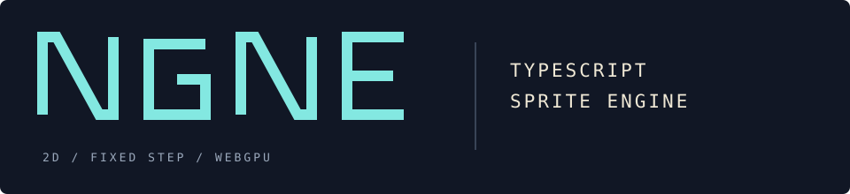
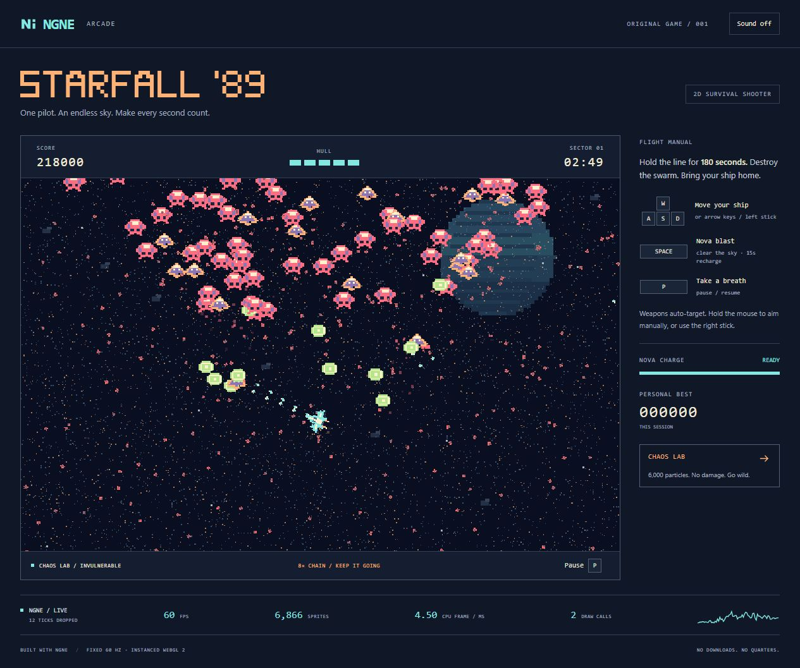

A TypeScript engine for 2D sprite games. Fixed-step simulation, scene-owned ECS worlds and instanced WebGL 2 rendering. **Zero runtime dependencies.**

[Play Starfall '89](https://that-webdev-dude.github.io/ngne/) · [Engine guide](docs/guide.md) · [First scene](https://that-webdev-dude.github.io/ngne/examples/hello/) · [MIT license](LICENSE)



**Early release · 0.1.0.** The engine exports independently from the showcase. Its API may change as more games exercise it. WebGL 2 is required; no editor, accounts or external game assets are needed.

## Run locally

Use Node.js 24 or newer.

```sh
git clone https://github.com/that-webdev-dude/ngne.git
cd ngne
npm ci
npm run dev
```

Open the URL printed by Vite. Select **Start Flight** for a three-minute survival run. Open `/examples/hello/` for the minimal engine example.

| Control | Action |
| --- | --- |
| WASD / arrows / gamepad left stick | Move |
| Hold mouse / gamepad right stick | Aim manually; otherwise auto-target |
| Space / gamepad A | Nova blast, 15-second recharge |
| P / Escape / gamepad Start | Pause |
| M | Toggle sound |

Small screens offer touch controls. **Chaos Lab** adds 6,000 persistent particles and invulnerability for stress testing. Scores persist across scenes within the running game and reset on reload.

## Build a game

Create components, spawn entities during scene setup, register update systems and prepare draw commands. NGNE owns the fixed-step loop and scene cleanup.

```ts
import { component, type SceneDefinition } from "ngne";

const Position = component("position", () => ({ x: 40, y: 100 }));

const scene: SceneDefinition = {
    id: "hello",
    setup(scene) {
        scene.world.spawn(Position.of());
        const points = scene.world.query(Position);
        scene.system(({ dt }) => {
            points.each((_, p) => { p.x += 40 * dt; });
        });
        scene.render(frame => {
            points.each((_, p) => frame.rect(p.x, p.y, 16, 16, 0x83e8e1));
        });
    },
};
```

For durable state, declare `SceneDefinition<State, Command>` and obtain explicitly injected access with `scene.state()`. `Game.prepare()` checks that the scene matches its Game; snapshots and transition inputs are deeply read-only, and commands are copied when dispatched. See the [state contract and migration](docs/contracts/NGNE.md#committed-state-typing-and-ownership).

Positions are sprite centers in logical pixels; `dt` is seconds. See the [runnable first scene](examples/hello/main.ts) for browser startup and smooth interpolation, then the [engine guide](docs/guide.md) for lifecycle, resources, state, assets and audio.

NGNE is not published to npm. Build this checkout to obtain ESM modules and declarations in `dist/engine/`; the entry point is `dist/engine/index.js`. The game build lives in `dist/`. The package remains private to prevent accidental npm publishing.

The demo and hello example use the package entry point. Development resolves it to
source; production builds emit the engine first and bundle both consumers against
those exports. Build also checks forbidden API usage against the emitted declarations.

`game.scenes` provides frozen summaries (`id`, definition ID, entity count/capacity,
freeze ticks), never live scenes. `game.enumerate()` provides detached frozen diagnostic
data. Lifecycle and simulation tick are read-only. Create scenes with `game.prepare()`
and leave world commits to the engine. See the [API migration notes](docs/contracts/NGNE.md#public-api-and-inspection).

## Verify

Await browser `start()` and `stop()` before another start/stop call; overlapping
calls reject. `dispose()` may interrupt either operation and remains terminal.
Repeated disposal calls share the same completion, including cleanup failures.
See the [lifecycle contract](docs/contracts/NGNE.md#platform-and-lifecycle).

```sh
npm test
npm run typecheck
npm run build
npm run preview
```

During development, `/validation.html` exercises real WebGL pixels, batching, context loss/restoration and browser lifecycle. This page is excluded from the production build. `npm run bench` measures CPU workloads, not GPU time or universal frame-rate guarantees.

GitHub Actions runs tests, typechecking and the build on pull requests and pushes to `main`. Successful main builds deploy the showcase to GitHub Pages. See [verification evidence and hardware limits](docs/verification.md).

## Documentation

| Document | Purpose |
| --- | --- |
| [Engine guide](docs/guide.md) | Authoring examples and lifecycle rules |
| [Architecture](docs/architecture.md) | Authoritative ownership and runtime model |
| [Capabilities](docs/capabilities.md) | Required and deferred engine behavior |
| [Implementation contract](docs/contracts/NGNE.md) | Precise implemented semantics |
| [Decisions](docs/decisions.md) | Design rationale |
| [Roadmap](docs/roadmap.md) | Current scope and next validation |
| [Showcase design](demo/DESIGN.md) | Starfall '89 art direction |

Save/restore, replay controllers, networking, editors and local multiplayer are deferred. Enumeration supports inspection; it is not a serialization format. Physical mobile/gamepad controls and additional browsers still need validation.

## Contribute

Change `src/` for the engine, `demo/` for Starfall and `tests/` for regression coverage. Run the checks above; use browser validation for rendering or browser lifecycle changes. Update the relevant guide or contract when behavior changes. Keep fixes small and report reproduction steps in issues.

The [prototypes](prototypes/README.md) are frozen historical evidence, not a second implementation to maintain.

## License

[MIT](LICENSE), including the engine and original showcase assets.
