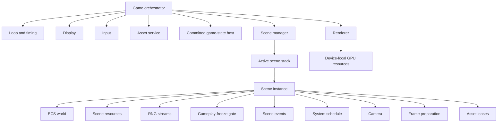
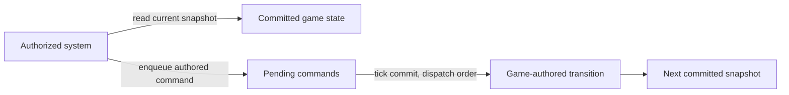
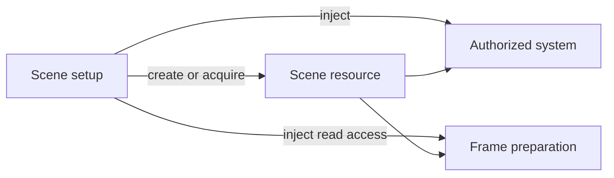
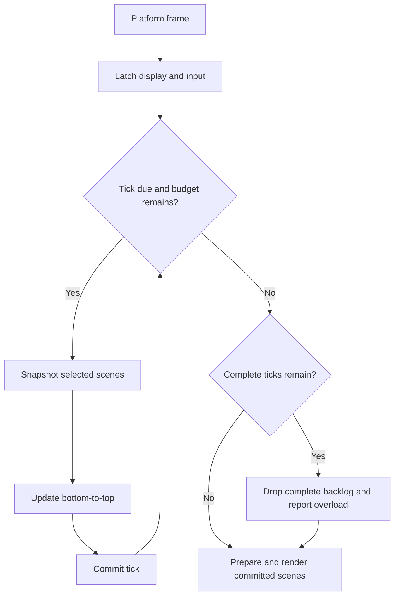
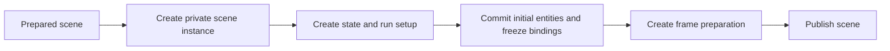
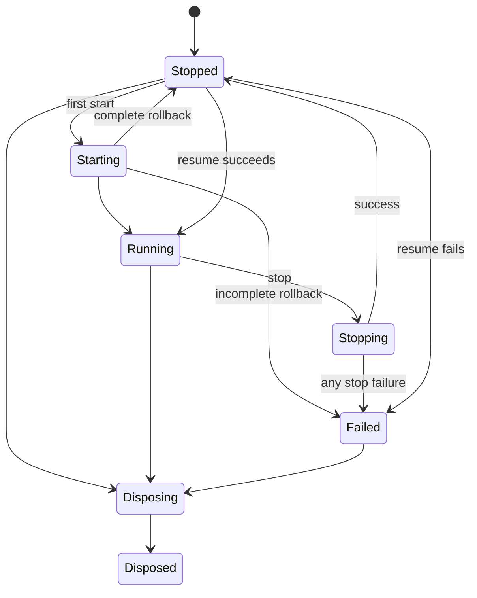

# Engine Architecture

## Purpose

This document is the authoritative high-level model for a 2D sprite game engine.

The engine uses fixed-step simulation, renders after simulation, supports several active scenes, and gives each mounted scene its own ECS world. Exact APIs, storage layouts, and renderer formats are pinned in the [implementation contract](contracts/NGNE.md); the reasoning behind the rules below lives in [decisions](decisions.md).

## Core rules

1. A platform frame and a simulation tick are different things.
2. A platform frame runs only a bounded number of fixed ticks.
3. The `Game` controls lifecycle and execution order.
4. Mutable simulation state has an explicit game or scene owner.
5. Eligible systems run once per selected scene update, in registration order.
6. Component and scene-resource values change immediately. Whole-entity spawn and despawn publish at commit.
7. Simulation randomness comes only from explicitly seeded, scene-owned streams.
8. Rendering reads committed scene state after simulation.
9. Asynchronous preparation finishes before private synchronous mounting begins.
10. Services and scenes are published only after they are fully ready.

## Required capabilities

The model must accommodate these capabilities without prescribing APIs or storage formats. Each links to the section holding its rules; work that is explicitly not required yet is listed in the [roadmap](roadmap.md#deferred).

| Capability                                | Rules                                                                                                          |
| ----------------------------------------- | -------------------------------------------------------------------------------------------------------------- |
| Persistent progression                    | [Committed game state](#committed-game-state)                                                                  |
| Simulation snapshot readiness             | [Simulation snapshots and replay readiness](#simulation-snapshots-and-replay-readiness)                        |
| Grid, tilemap, and non-entity scene state | [Scene resources](#scene-resources)                                                                            |
| Entity lifetime and structural churn      | [Mutation and scene events](#mutation-and-scene-events)                                                        |
| Deterministic randomness and replay input | [Deterministic randomness](#deterministic-randomness), [snapshots](#simulation-snapshots-and-replay-readiness) |
| Camera interpolation and pixel snapping   | [Rendering and cameras](#rendering-and-cameras)                                                                |
| Gameplay-local freeze                     | [Systems and gameplay freeze](#systems-and-gameplay-freeze)                                                    |
| Speculative scene preparation             | [Loading, mounting, and teardown](#loading-mounting-and-teardown)                                              |

Cross-world transient messaging is deferred and local multiplayer input is out of scope; both are recorded in the roadmap.

## Main terms

| Term                      | Meaning                                                                                                           |
| ------------------------- | ----------------------------------------------------------------------------------------------------------------- |
| Platform frame            | One callback from the host display loop.                                                                          |
| Simulation tick           | One fixed-duration simulation step.                                                                               |
| Scene definition          | Portable authoring data used to create scene instances.                                                           |
| Scene instance            | One mounted scene with its own world and runtime state.                                                           |
| Scene resource            | Non-entity data owned by one scene instance.                                                                      |
| Committed game state      | Game-authored state visible for the whole current tick.                                                           |
| Gameplay freeze           | A scene-local gate that temporarily skips ordinary gameplay systems.                                              |
| Commit                    | The boundary where buffered simulation changes are published.                                                     |
| Simulation-state snapshot | A future capture of authoritative simulation state at a completed commit; it excludes future environmental input. |
| Frame preparation         | Conversion of committed scene data into renderer input.                                                           |
| Asset lease               | A scene's claim on a shared engine asset.                                                                         |

## Ownership and state lifetimes



State belongs to the narrowest lifetime that needs it.

| State                                         | Owner          | Survives                          | Ends with                                |
| --------------------------------------------- | -------------- | --------------------------------- | ---------------------------------------- |
| Root seed and committed game state            | `Game`         | Scene replacement and stop/resume | `dispose()`                              |
| World, resources, RNG, freeze, events, camera | Scene instance | Suspension and stop/resume        | Scene unmount                            |
| Shared authored or decoded assets             | Asset service  | Scene replacement                 | Asset-service disposal or cache eviction |
| GPU resources                                 | Renderer       | Scene replacement when shared     | Renderer disposal or device replacement  |

The `Game` owns order and lifetime, not gameplay rules, ECS layout, or renderer batching.

## Committed game state

Each `Game` owns one game-state host. The game supplies its schema, initial value, typed commands, and synchronous transition logic. The engine owns its lifetime and commit timing but does not interpret its contents.



Rules:

- Scene setup injects narrow state access only into systems that need it.
- Systems read the same committed snapshot for a whole tick and never mutate it directly.
- Commands publish after scene updates and before scene-stack commands.
- Scene setup may read committed state but may not enqueue state commands.
- The host stores durable game facts such as progression and room history keyed by stable authored identities, never scene entities, entity handles, queries, cameras, or event queues.
- Committed facts survive scene replacement, suspension, and stop/resume for the lifetime of one `Game`; separate `Game` instances remain isolated.
- Re-entering a scene rebuilds its entities from committed facts; entities do not move between worlds.
- Serialization and external storage remain deferred.

## Scene model

### Scene definition and instance

A scene definition is portable authoring data. It identifies the scene, its stack policy, required assets, and synchronous setup. It owns no world, mutable runtime state, GPU resource, or active lifecycle.

Mounting creates a private scene instance with an isolated world, resources, RNG streams, freeze state, events, fixed system schedule, camera, frame preparation, and asset leases. Two instances of one definition share no mutable scene state. Entity handles have meaning only in their owning world.

### Scene resources

Scene resources hold data that does not naturally fit an entity or component, such as a puzzle board, mutable tile overlay, or collision index.



- Resource bindings are created during mounting and fixed before publication.
- Mutable contents change immediately; later systems see earlier changes in registration order.
- Suspension preserves resources. Unmount releases them.
- Shared immutable definitions remain asset-owned and are leased by the scene.
- Durable results are written deliberately to committed game state.
- Authoritative resource state cannot live only in a closure and must be enumerable for future snapshot work. No snapshot registration scheme is required yet.
- The engine defines no board, tilemap, collision, or hitbox schema; dense boards may use arrays or grids and static definitions may remain immutable asset data.

### Deterministic randomness

Each `Game` resolves one immutable root seed. Each scene instance owns the mutable state of its named RNG streams.

- A scene seed derives from the root seed, scene-definition ID, and an authored mount seed key, unless an explicit scene seed is supplied.
- Seeds never depend on wall-clock time, mount order, stream creation order, or asynchronous completion order.
- A stream derives from the scene seed and a stable authored name. Separate names isolate unrelated draws.
- Required streams are injected into systems during mounting and fixed before publication.
- Rendering never consumes simulation streams.
- Failed private mounting discards only the private scene's streams.
- Current stream state is authoritative scene state and must be enumerable.

## Scene stack and communication

Scenes are ordered bottom-to-top. `set`, `push`, and `pop` commands are buffered and applied in request order at commit. The topmost scene marked `blocksUpdateBelow` suspends lower scenes without hiding them from rendering.

Communication uses the existing ownership boundaries:

| Need                                            | Mechanism                                    |
| ----------------------------------------------- | -------------------------------------------- |
| Immediate coordination inside one scene         | Components, scene resources, or scene events |
| Durable facts needed by later or mounted scenes | Committed game state                         |
| Modal behavior and scene replacement            | Scene-stack commands                         |
| Live HUD                                        | Frame preparation in the gameplay scene      |

General transient messaging between independently mounted worlds is deferred until a concrete game requires it. Direct access to another scene's world, entities, queries, or resources is not allowed.

## Systems and gameplay freeze

Each scene has one immutable, registration-ordered system schedule. A system has one update operation. There is no separate input phase or dynamic scheduler.

- Systems register during mounting as ordinary gameplay by default or as `runsDuringFreeze`.
- Registration order declares same-tick dependencies.
- Authoritative mutable state belongs in components, scene resources, or committed game state, not only in system fields or closures.
- Stateful behavior changes data rather than adding, removing, or reordering systems.

Finite-state machines and sequencers follow that same rule: character state belongs in components, while scene-wide phases or cutscene steps belong in scene resources. They do not require a separate scheduler.

Each scene owns one integer-tick gameplay-freeze gate for hitstop:

- A system with an injected capability may request a positive duration.
- Requests publish at commit, so the current schedule always finishes.
- Several requests at one boundary resolve to the longest duration; they are not added.
- While frozen, ordinary systems are skipped. `runsDuringFreeze` systems continue at the fixed delta and in normal registration order.
- Suspension runs no systems and pauses the freeze countdown.
- Gameplay timers use remaining-duration counters changed only by ordinary gameplay systems. There is no separate gameplay clock.
- Gameplay event inboxes remain pending until ordinary gameplay resumes.
- The freeze state survives stop/resume and ends on unmount.

Fractional slow motion, named time domains, and per-entity time scaling remain deferred.

## Tick context and input

An invoked system receives a scene-scoped context with fixed duration, global simulation tick, tick input, display snapshot, its scene world, allowed scene events, camera access, and scene-stack commands. Resources, RNG, freeze requests, and game-state access are explicit injected dependencies rather than a universal registry.

The input service collects platform events and produces one stable logical-player snapshot per simulation tick:

- Held state appears on every tick.
- Press, release, pointer, and wheel edges appear on one consuming tick.
- If a platform frame runs several ticks, its edges appear only on the first tick.
- If it runs no ticks, pending edges wait for the next tick.
- Every updating scene receives the same snapshot.

Keyboard, pointer, and gamepad input may all contribute to that one logical-player snapshot.

Local multiplayer input and controller ownership are out of scope. An input-buffering system that must run during hitstop opts into `runsDuringFreeze`.

## Mutation and scene events

Component fields and scene-resource contents change immediately. Later systems observe earlier writes.

An entity receives its complete component set when it spawns. Runtime component addition and removal are unsupported. Whole-entity spawn and despawn are buffered until the scene-world commit.

- A pending spawn is not query-visible.
- An entity queued for despawn remains visible and writable for the current update.
- Immediate logical exclusion uses an ordinary value such as `active = false` before despawn is queued.
- Committed despawns release reusable storage, and stale handles cannot target later entities that reuse it.
- Storage growth follows live or peak demand, not cumulative spawn count.

Each scene owns an event inbox and outbox. Events emitted during one ordinary update become a read-only broadcast inbox for that scene's next ordinary update. A suspended or gameplay-frozen scene holds its inbox. Events end with the scene.

## Platform frame and tick commit

Each platform frame runs zero or more fixed ticks up to a positive finite budget, then renders once.



The tick budget is fixed while running. If it is exhausted, the loop drops complete pending ticks, retains the fractional interpolation remainder, and reports the loss outside simulation. It never enlarges the fixed delta.

One tick commits in this order:

1. Snapshot the update plan from the committed stack.
2. Update selected scenes bottom-to-top.
3. Publish whole-entity spawn and despawn.
4. Advance event buffers only for scenes whose ordinary systems ran.
5. Commit freeze countdowns and requests.
6. Apply game-state commands.
7. Apply scene-stack commands and publish the resulting stack.

A scene command may mount a prepared scene during step 7. If that mount fails:

- Steps 3-6 remain committed.
- The failed scene command is discarded.
- All later scene-stack commands for that boundary are discarded.
- Scene-stack commands that succeeded before the failure remain effective; their resulting stack is published.
- The tick completes and the `Game` remains `Running`.
- The failure is reported as a diagnostic.

This is not transaction rollback for the whole tick; it is failure isolation at the scene-stack stage.

## Simulation snapshots and replay readiness

Save, restore, replay control, and rollback remain deferred. The architecture preserves one coherent simulation-state boundary after a completed tick commit and before the next tick.

At that boundary, explicit owners must make all authoritative simulation state enumerable, including:

- Global simulation tick, root seed, compatibility identity, and committed game state.
- Active scene order, policies, definition identities, mount seed keys, and instance identities.
- Live entities, component values, allocator state, authoritative scene resources, RNG state, freeze state, and event buffers.
- Camera state when it can affect future simulation.

Systems and closures cannot be the only owners of authoritative state. GPU state, decoded caches, wall-clock state, the platform-frame accumulator, and future environmental input are outside a simulation-state snapshot. The [ownership inventory](contracts/NGNE.md#simulation-state-ownership-inventory-ngne-5) records the current production owners and external inputs; public enumeration is lossy diagnostic data, not a capture of those owners.

A replay from the beginning requires:

- Initial committed game state.
- Root seed and authored mount seed keys.
- A recorded logical input snapshot for every simulation tick, including ticks whose input has no edges.
- Compatibility identity for engine simulation rules, RNG behavior, and authored game and asset data.

This boundary does not define capture structures, reconstruction, compatibility policy, asset reacquisition, or atomic restore.

## Rendering and cameras

After the final tick, each active scene prepares renderer input from its committed world, explicit resources, camera, asset handles, and one shared interpolation value.

Render order is:

```text
scene stack order
    -> scene-local layer
        -> local depth or authored order
            -> safe renderer batching
```

The renderer cannot reorder across scene boundaries and knows nothing about entities, systems, or scene policies.

Each scene owns one camera with previous and current committed poses. Frame preparation interpolates the base camera and ordinary gameplay transforms with the same value. Mounting, teleporting, an authored cut, or freeze activation makes previous equal current for those poses. During freeze, continuing effects such as particles or camera shake own separate presentation values; camera shake is applied after the frozen base camera. Pixel snapping happens after interpolation and never changes simulation state.

Suspended scenes render their current committed poses using alpha 1 for camera and
frame preparation. After suspension or host resume, that value remains 1 until the
scene next updates. This prevents replaying its last movement without rewriting
preserved simulation poses. Selected frozen scenes still use the frame alpha so
independent continuing effects can interpolate.

## Assets

The asset service owns shared renderer-independent authored or decoded data and exposes stable handles. Scenes own leases. Worlds store stable asset handles, never GPU identities. The renderer owns device-local resources and may recreate them without changing simulation data.

Mutable per-scene derivatives belong in scene resources. Releasing a lease does not require immediate cache eviction.

## Loading, mounting, and teardown

Preparation is asynchronous and outside simulation. It acquires leases and prepares immutable data but creates no world or active scene. Cancellation and stale completion cannot activate a scene.

A game may prepare a likely next scene before requesting a transition. This speculative preparation has no simulation effect until a later scene command consumes it.

Mounting is synchronous at a tick boundary:



Every acquired or created item registers one cleanup action as mounting proceeds. Normal unmount and failed mount use the same teardown stack, unwound in reverse registration order. Cleanup is best-effort: every action is attempted and failures are reported together. A partly disposed scene is never republished.

For `set`, the replacement mounts successfully before old scenes are removed. A failed private mount never changes the published stack.

## Lifecycle



### First start

The first `start()` initializes display, input, assets, renderer, and scene management; prepares and mounts the initial scene; then starts the loop last. Each successful step registers rollback. A failure unwinds that attempt in reverse order. Complete rollback returns to `Stopped`; incomplete rollback enters `Failed`.

### Stop and resume

`stop()` is a suspension, not teardown:

1. Disable future tick and render work immediately, so a late callback is harmless.
2. Stop the loop.
3. Cancel pending preparation and scene transitions.
4. Preserve initialized services, committed game state, mounted scenes, resources, RNG, freeze, cameras, and leases.

Both stop actions are attempted. If either fails, the game reports all failures and enters `Failed`; only `dispose()` is then allowed. If both succeed, it enters `Stopped`.

A later `start()` from this stopped state is a resume. It starts the loop while tick and render work remain disabled, then enables work only after loop startup succeeds. It does not initialize services or recreate the initial scene. A `Game` records whether first start has completed, so cold start and resume cannot take the same path accidentally.

If loop startup fails during resume, work stays disabled, the engine makes a best-effort attempt to stop any partially started loop, preserves the mounted scenes and initialized services for disposal, reports all failures, and enters `Failed`. Only `dispose()` is then allowed.

### Dispose

`dispose()` is terminal. It disables work, stops the loop, cancels loading, unmounts scenes, and releases game state, renderer, assets, input, and display in reverse dependency order. Every cleanup is attempted. Failures are reported together and the final state is always `Disposed`.

## Deferred work

API, storage, and renderer choices this model once left open are pinned in the [implementation contract](contracts/NGNE.md). Work deferred until a concrete game needs it is listed in the [roadmap](roadmap.md#deferred).
