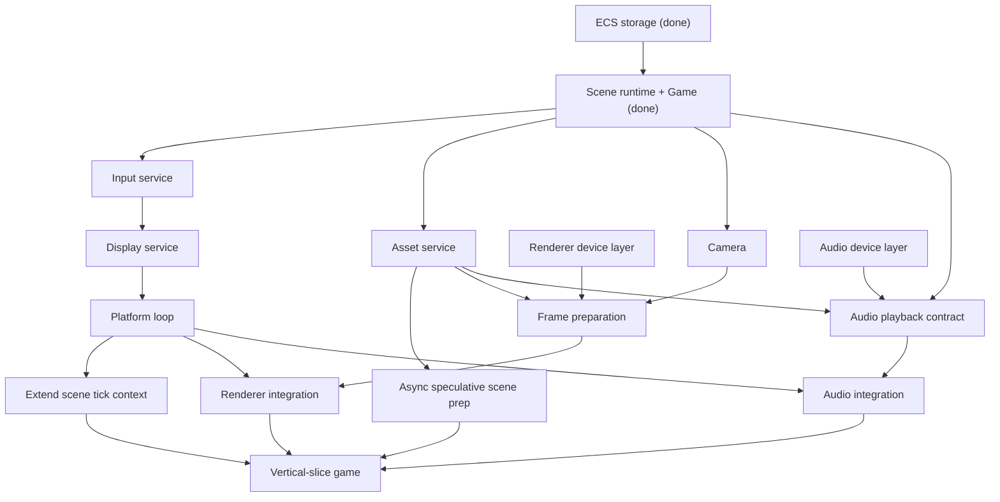

# Engine Roadmap

Path from the current engine state to a ready-to-write-games baseline.

## Status

| Domain | State |
| --- | --- |
| ECS storage (`src/ecs.ts`) | Implemented: dense archetypes, buffered lifetime, generations and slot reuse. |
| Scene runtime, manager, `Game` lifecycle (`src/scene.ts`) | Implemented: isolated mounting, committed state, events, RNG, freeze and cleanup. |
| Input, display and platform loop | Implemented in `src/input.ts`, `src/browser.ts` and `src/primitives.ts`. |
| Assets and speculative preparation | Implemented in `src/assets.ts` and `src/scene.ts`. |
| Renderer, camera and frame preparation | Implemented: instanced WebGL 2, texture batching, interpolation and restoration. |
| Audio | Implemented: leased decoded clips, synthesis, scoped mixing, ducking and commit-driven playback. |
| Vertical-slice game | Playable Starfall '89, including Chaos Lab. |

Updated 7 September 2026. The original code and contracts marked "done" above were **not present in the supplied workspace**. The implementation now uses the consolidated [NGNE contract](contracts/NGNE.md), [verification evidence](verification.md), and [integrated v00 audit](../prototypes/ngne/v00/AUDIT.md). The historical dependency plan below is retained as rationale; its references to absent source/handoff files are historical, not current implementation locations. The referenced `cluster-renderer` source was also absent, so the renderer was implemented standalone against synthetic inputs instead of ported.

## Process

Every remaining domain follows the same path already used for `ecs` and
`scene`:

```text
prototypes/<domain>/v00  ->  audit loop (max 5 rounds)  ->  zero blockers
    -> promote to src/<domain>/  ->  contract in docs/contracts/ if non-trivial
```

See `prototypes/scene/IMPLEMENTATION-HANDOFF.md` and
`prototypes/scene/PRODUCTION-PROMOTION.md` for the concrete gate shape to
reuse per domain.

## Dependency graph



`Renderer device layer` and `Audio device layer` touch no entity, scene, or
system state, so both can start immediately in parallel with Track A below.

## Track A — runtime loop

Sequential; nothing plays without this.

1. **Input service** — one logical-player snapshot per tick from platform
   events (held state every tick; press/release/pointer/wheel edges on one
   consuming tick), per `architecture.md`'s "Tick context and input".
2. **Display service** — owns the canvas/viewport surface, resize, and the
   per-frame display snapshot. The timing source is the injected host frame
   scheduler, consumed by the loop directly.
3. **Platform loop** — fixed-step accumulator with a bounded tick budget;
   drops complete backlog and reports overload on exhaustion, per
   `decisions.md`'s "Bounded fixed-step catch-up". The loop is a timing
   primitive; a `Game`-owned frame runner latches display and input, then
   drives `Game.tick()` / `Game.render()`.
4. **Extend the scene tick context** — thread fixed duration (`dt`), tick
   input, and display snapshot into `SceneSystemContext` (currently only
   `world` / `simulationTick` / `sceneStack`). Depends on 1-3.

## Track B — assets

5. **Asset service** — shared, renderer-independent authored/decoded data
   behind stable handles; scenes hold leases. Feeds rendering, audio, and
   speculative prep below. Depends only on Scene, not on Track A.

## Track C — rendering

6. **Renderer device layer** — port `cluster-renderer`'s device/pipeline/
   buffer/texture primitives standalone, proven against synthetic input, with
   no entity or scene coupling (`prototypes/renderer/v00`).
7. **Camera** — per-scene previous/current pose, interpolation, pixel
   snapping, per `architecture.md`'s "Rendering and cameras" and required per
   `capabilities.md`.
8. **Frame preparation** — the scene-owned adapter turning committed `World`
   + resources + camera + asset handles + one shared interpolation value into
   the renderer's packed-frame format. Depends on 5, 6, 7 — this is where 6's
   actual input shape gets pinned down for real.
9. **Renderer integration** — wire frame-prep output into the renderer; the
   render call happens after the platform loop's final tick. Depends on 3, 8.

## Track D — audio

Not currently named as a required capability in `capabilities.md` or
`architecture.md` (audio appears once, in `architecture.md`'s deferred list).
Included here as a deliberate roadmap addition; formalizing it as a required
engine capability would mean updating `capabilities.md` separately.

10. **Audio device layer** — Web Audio API context/graph, decoded-buffer
    loading, source and gain node management, standalone with no entity or
    scene coupling. Can start in parallel with 6.
11. **Audio playback contract** — the seam between scene-triggered sound and
    music events (reusing scene event channels, or an equivalent mechanism)
    and the audio device layer: mixing, per-scene volume, and ducking rules.
    Depends on Scene, 5, and 10.
12. **Audio integration** — wire scene-triggered playback into the platform
    loop; playback triggers from committed scene state, independent of
    render timing. Depends on 3, 11.

## Track E — speculative scene preparation

13. **Async scene preparation** — `prepareSceneCandidate` currently models
    only synchronous intent. Make preparation genuinely asynchronous
    (acquires leases, no simulation effect until a later scene command
    consumes it), per `capabilities.md`'s "Speculative scene preparation".
    Depends on 5.

## Convergence

14. **Vertical-slice game** — a small real example exercising the full
    stack: input, fixed tick, sprites and sound on screen, scene-stack
    transitions, persistent progression, and gameplay freeze, in an actual
    playable scenario rather than unit tests alone. This is the real
    ready-to-write-games milestone, not step 13. Depends on 4, 9, 12, 13.

## Explicitly deferred

Do not build until a concrete game needs it — each is deferred by
`architecture.md` itself, not merely unscheduled:

- Simulation snapshot capture, restore, and replay control (the enumeration
  boundary these need already exists, per `decisions.md`'s "Simulation-state
  snapshot boundary").
- Cross-scene transient messaging.
- Local multiplayer input (indexed players, controller assignment).
- Fractional or selective time scaling.
- Multiple views, networking, editor support, hot reload, and
  multithreading.
