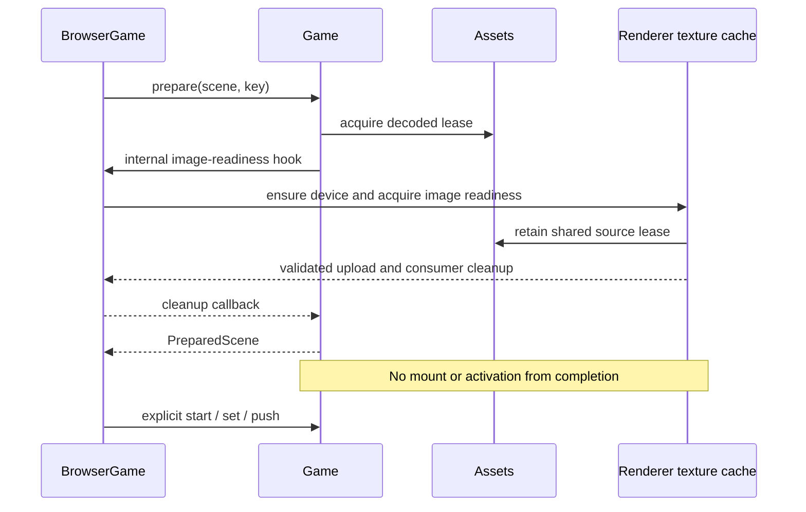

# NGNE-21: WebGPU renderer and image readiness

Planning date: 11 September 2026. Proposal only; implementation is not authorized by this planning task. Independent review and the approval hash belong in [the review log](NGNE-21-review-log.md).

Jira: [NGNE-21](https://thatwebdevdude.atlassian.net/browse/NGNE-21), “Replace WebGL renderer and asset upload with WebGPU”. Live description read on the planning date, including its v03 reuse decisions. NGNE-19 and NGNE-26 are Done. NGNE-27 owns migrating Starfall/platformer and deleting WebGL; NGNE-13 owns CI integration, NGNE-14 the second browser/GPU combination. This plan supersedes neither the implemented NGNE-20 storage contract nor its temporary object-component bridge.

## Goal and acceptance

Adapt the specified cluster-renderer v03 core into NGNE's existing committed-state → Frame → Renderer boundary. Deliver WebGPU hello and focused browser validation, typed scene-image preparation, safe resource ownership and device recovery. Keep the two existing games usable through the temporary WebGL path.

Completion requires:

- Hello renders textured and solid sprites through WebGPU. Scene, layer, depth and insertion order, center rotation, UV orientation, straight-alpha input, camera interpolation, shake, pixel snapping and screen coordinates retain their current meaning.
- Frame packs 14 float32 values/56 bytes per sprite without per-sprite objects or typed-array views. CPU field order, vertex attributes and WGSL agree. Buffers grow within actual device limits.
- Image preparation waits for upload validation; missing/failed images reject preparation. Shared consumers, cancellation, release, stop, disposal and lost-device recovery have tested outcomes. GPU identities never enter ECS, scene assets, Game state or inspection.
- Asynchronous startup rolls back cleanly. Unsupported WebGPU reports an actionable error. Frames recover after a lost device, or report an explicit terminal rendering failure. No silent fallback or unbounded retry loop.
- Ordering, alpha, upload/failure, resize, growth, stop/resume, disposal and loss/recovery pass on one recorded real browser/GPU combination. Mocks and simulated loss are identified separately from physical GPU/driver loss.
- All repository proof commands pass, both legacy games still run, and owning documentation is updated with the implementation. No portability or real-game WebGPU performance claim is made here.

## Assumptions and decisions

| Decision                                                                              | Evidence                                                                                                              | Planned consequence                                                                                                                                                                                              |
| ------------------------------------------------------------------------------------- | --------------------------------------------------------------------------------------------------------------------- | ---------------------------------------------------------------------------------------------------------------------------------------------------------------------------------------------------------------- |
| Reuse v03 at `34458a987f03b00894e98a40d39fc0ae666194f6`.                              | Jira; live source HEAD matched, source working tree was clean.                                                        | Adapt the listed files, retain provenance, never copy newer/other prototype trees or modify cluster-renderer.                                                                                                    |
| NGNE-20 is already implemented.                                                       | NGNE HEAD `94a70a0393060707908a226c9e2d2107bdbae01c`; `src/ecs.ts`, `docs/contracts/NGNE.md`, `docs/verification.md`. | Preserve schema APIs and legacy ECS bridge. No ECS implementation work.                                                                                                                                          |
| WebGL must remain executable until NGNE-27.                                           | Jira required work 7; `demo/main.ts` manually uploads its atlas after start.                                          | Retain the old Renderer export and default browser path temporarily; hello explicitly opts into WebGPU.                                                                                                          |
| Initial intended target is visible Chrome on Windows 11, Intel UHD Graphics (0x46A3). | NGNE-26 dated evidence; installed Chrome executable currently reports 152.0.7977.84.                                  | Before implementation validation, record actual Chrome version, WebGPU adapter info, backend/driver where available and hardware acceleration. Historical ANGLE/D3D11 data does not identify the WebGPU adapter. |
| Prepared scenes are single-use, asynchronous leased intent.                           | `Game.prepare`, `SceneCandidate`, candidate slots, contract.                                                          | GPU readiness joins preparation through one internal host hook; mounting remains synchronous and explicit.                                                                                                       |
| Loaded decoded assets remain cached until Assets disposal.                            | `src/assets.ts`.                                                                                                      | Preserve that policy. Renderer retains a separate source lease while a texture entry is live; release does not close the shared bitmap.                                                                          |
| Browser dimensions are fixed logical pixels.                                          | `BrowserGame.width/height`, Frame camera/input/display contracts.                                                     | Keep logical dimensions and input mapping; canvas backing size remains browser-owned. Do not introduce automatic DPR scaling or a responsive layout API.                                                         |

Resolved decision map: v03 adaptation; explicit temporary WebGPU opt-in; one shared 14-float Frame; center-preserving affine conversion; internal preparation hook; renderer-owned texture cache; bounded device recovery; one real hardware target. No unresolved product decision requires guessing. If evidence contradicts a material assumption, revise this plan before building that portion.

## Source adaptation and file ownership

Canonical source root: `C:/Users/jfabi/Documents/Projects/cluster-renderer/.versions/v03/`. Supporting specifications: `C:/Users/jfabi/Documents/Projects/cluster-renderer/.docs/`, especially `09-decisions.md` D-01–D-34. Those decisions are source rationale, not authority over NGNE.

| Source                                                                 | Intended destination/responsibility                                                                                | Required adaptation                                                                                                                                                                                            |
| ---------------------------------------------------------------------- | ------------------------------------------------------------------------------------------------------------------ | -------------------------------------------------------------------------------------------------------------------------------------------------------------------------------------------------------------- |
| `gpu/QuadRenderer.ts`                                                  | `src/quad-renderer.ts`                                                                                             | Pipeline/bind-group reuse, instance growth, indexed quads and adjacent runs. Consume NGNE's sorted stream, not QuadFrame/FrameArena. One alpha pipeline for preferred format, sample count 1, nearest sampler. |
| `gpu/quadShader.ts`                                                    | `src/quad-shader.ts`                                                                                               | Keep affine WGSL and 48-byte uniforms; CPU camera already applied, shader camera identity. Explicit debug option, default false.                                                                               |
| `gpu/QuadBufferLayout.ts` and only constants from `frame/QuadFrame.ts` | `src/quad-layout.ts`                                                                                               | 14 fields, vertex layouts, stride assertion. Constants stay importable in Node without accessing GPU globals at module load.                                                                                   |
| `gpu/GpuContext.ts`                                                    | `src/gpu-context.ts`                                                                                               | Adapter/device/canvas ownership, fresh acquisition per frame, submit, cancellation and recovery generations. Replace Display imports with dimensions supplied by browser/renderer.                             |
| `gpu/createResourceRegistry.ts`                                        | `src/resource-registry.ts`                                                                                         | Adapt lookup/replace/release and cache invalidation. Keep identifiers private and remove packed-sort-key assumptions.                                                                                          |
| Selected `assets/TextureAssets.ts` ownership/rollback logic            | `src/texture-assets.ts`                                                                                            | Retained decoded leases, asynchronous upload validation, shared consumers and NGNE string IDs. Do not port its captured permanent device or manager dependency.                                                |
| NGNE integration                                                       | `src/renderer.ts`, new `src/webgpu-renderer.ts`, `src/browser.ts`, `src/assets.ts`, `src/scene.ts`, `src/index.ts` | Shared Frame, temporary legacy bridge, async browser lifecycle, image marker and internal readiness hook.                                                                                                      |

Do not port RendererManager, FrameArena, QuadFrameValidator, Camera, quadAuthoring, Display, RenderTargets/MSAA, demos or demoEcs. No new blend modes, public scissors, render graph, worker, atlas manager, residency system, plugin backend registry or frame transaction API. Existing full-target clipping is sufficient; source scissor math is reference material only until a consumer requires authored clipping.

Read the pinned originals and compare actual adaptation against them. If source access fails, stop and repair read access; do not invent a replacement from memory. The Jira copy-first contingency is an implementation step only after access is available, not permission to edit production during planning. Record source path and commit in `docs/decisions.md` and, when committing is authorized, in the port commit's one-line `[NGNE-21]` message. Keep imports `.js`, names kebab-case, and remove `import.meta.env.DEV`, Vitest, source manager types, non-null assertions and unneeded options from adapted code.

## Public surface and temporary WebGL path

- Keep `Frame`, `Sprite` and their existing authoring calls. Document the intentional raw `Frame.data` format change.
- Keep the current exported `Renderer` as the legacy WebGL implementation for this ticket. Add `WebGPURenderer.create(canvas, width, height, onError?) → Promise<WebGPURenderer>` as a deliberate platform integration API; private construction prevents observing partial initialization. It exposes the same synchronous `render(frame, clear)`, `drawCalls`, `sprites`, idempotent `dispose()`, asynchronous `texture(id, source, signal?) → Promise<void>` for host-created images, and a readonly presentation `status` (`ready`, `recovering`, `failed`, `disposed`; initialization is private).
- Add the narrow transitional `BrowserOptions.renderer?: "webgpu"`. Omission preserves today's WebGL default; `"webgpu"` selects only WebGPU and fails clearly when unavailable. There is no retry on WebGL. `BrowserGame.renderer` is a union of the two concrete implementations. Record this migration-only switch for NGNE-27 to remove when WebGPU becomes the sole path.
- Hello uses `renderer: "webgpu"`; Starfall/platformer source authoring remains unchanged. This is not their migration ticket. New WebGPU tests call the async factory; legacy validation continues exercising the old constructor.
- Both renderers consume the same 14-float Frame. Change only the legacy vertex attribute descriptors and vertex shader to accept the affine representation. Keep its old upload/loss behavior; no separate WebGL optimization project. This avoids a second per-frame 13-float packing path and trigonometric inverse conversion.
- Add approved `@webgpu/types` as a pinned devDependency, lockfile update and explicit tsconfig type inclusion for source/library builds. Verify its current release at implementation time. Override `tests/tsconfig.api.json` with `types: []` and `skipLibCheck: false` so the built-package consumer fixture detects ambient GPU type leaks. Keep public-reachable declarations free of GPU-specific identifiers/imports; internal GPU module declarations may use them but must not be reachable from `ngne` exports. Node importing `ngne` must not require navigator, GPUBufferUsage or a browser context.

## Frame format and rendering

For a centered Sprite, first apply the existing camera subtraction and rounding to center `(x,y)` exactly as today, including the current `screen` and `pixelSnap` behavior. Then with `c=cos(rotation)`, `s=sin(rotation)`:

```text
ix = c * width       iy = s * width
jx = -s * height     jy = c * height
tx = x - (ix+jx)/2   ty = y - (iy+jy)/2
position(corner) = (tx,ty) + corner.x*(ix,iy) + corner.y*(jx,jy)
```

The center is recoverable as `(tx+(ix+jx)/2, ty+(iy+jy)/2)`. Round the center before affine conversion, never independently round the translated corners. Rect uses rotation zero and the same center convention. Preserve negative/zero sizes already accepted by the authoring API; no undocumented pivot change.

| Floats | Bytes | Fields         | Vertex input          |
| ------ | ----- | -------------- | --------------------- |
| 0–1    | 0–7   | tx, ty         | location 0, float32x2 |
| 2–5    | 8–23  | ix, iy, jx, jy | location 1, float32x4 |
| 6–9    | 24–39 | u0, v0, du, dv | location 2, float32x4 |
| 10–13  | 40–55 | r, g, b, a     | location 3, float32x4 |

Corner buffer: 8-byte vertex stride, location 4 float32x2; four unit-square corners and six uint16 indices from v03. The 48-byte uniform has viewport vec2 at 0, debug f32 at 8, padding at 12, camera vec4 `(1,0,0,1)` at 16, translation vec2 `(0,0)` at 32 and padding at 40. Use a fixed binding with `minBindingSize: 48`; discard the source's unused dynamic-offset array.

- `Frame.sort()` remains scene > layer > depth > insertion. Parallel texture/order/scene/layer/depth arrays stay CPU-owned. Never sort by texture, handle or sampler.
- Repack sorted instances into a reusable Float32Array with numeric loops, without per-sprite `subarray`, spread, objects, closures or views. Reuse run arrays or scan sorted texture IDs directly. One draw per adjacent compatible texture run, including the white texture for untextured rectangles. A/B/A remains three runs even if merging A would be faster.
- One instance upload per nonempty frame: `queue.writeBuffer(buffer, 0, upload, 0, count * 14)` (TypedArray element count); uniform upload is 48 bytes. Zero sprites still clears. Preflight count, lengths, required texture readiness and buffer limits before acquiring/encoding a pass.
- Initialize one explicit pipeline layout, alpha pipeline, uniform/index/corner buffers and nearest clamp sampler per device generation. Create bind groups during texture readiness, not one string key or Promise per draw. Replacement/release invalidates affected state; a full cache clear is acceptable initially if all required groups are rebuilt before the next render.
- Geometrically grow CPU/GPU buffers; bound capacity by safe numeric arithmetic and `device.limits.maxBufferSize / 56`. Over-limit frames report once per failure episode, skip submission, and accept a later valid frame. Destroy replaced buffers after all referring command buffers have been submitted; the facade owns synchronous encode-and-submit, so no arbitrary N+2 frame lag or per-frame queue wait is required. Final disposal also destroys any temporarily retained buffers.
- Inputs remain straight alpha; texture format `rgba8unorm`, explicit sRGB copy metadata, `premultipliedAlpha: false`, no Y flip. The shader multiplies sampled tint and then premultiplies RGB once; blend color and alpha use one / one-minus-src-alpha. Preferred canvas format, premultiplied canvas alpha, opaque clear alpha 1. No depth, no MSAA. Test semi-transparent source pixels combined with Sprite alpha, not only opaque textures.
- `render` never owns an open transaction across calls. Synchronous errors discard that submission, reset counters/temporary state in `finally`, and report through the provided diagnostic. A subsequent valid frame must render. Missing/unready texture IDs skip the whole frame and report once per ID per consecutive fault episode; clear suppression after a successful valid frame. Use the same episode suppression for persistent dimension/count/encoding faults so no failure logs at rAF frequency. Document the intentional temporary difference: legacy missing-texture errors still enter Game Failed through the old thrown-error path; WebGPU skips/reports and can accept a corrected frame. Device errors and loss handlers are generation-guarded; diagnostic callbacks themselves cannot escape and break Game execution.

## Image readiness and leases

Keep `Asset<T>`, `Lease<T>` and renderer-independent `Assets` semantics. Add an explicit `ImageAsset extends Asset<ImageBitmap>` with readonly `kind: "image"`; `imageAsset()` returns it. Decode with `createImageBitmap(blob, { premultiplyAlpha: "none", colorSpaceConversion: "none" })`; use these options for manual snapshots too. The authoring convention is sRGB image bytes; no new wide-gamut/profile policy is promised. Already-premultiplied canvas/bitmap inputs can have lost precision before acquisition, so snapshots cannot recover those original bytes. Test translucent pixels against the actual decoded input and allow at most two 8-bit code values for compositing roundoff. Do not infer GPU upload from an arbitrary asset's runtime value. Authored custom image loaders can implement the same typed marker and must follow the documented image convention. Other assets remain unchanged; SceneSetup still receives decoded values, never GPU objects.

Install one internal, non-barrel-exported symbol capability from BrowserGame into its owned Game. Its function accepts an asset definition and AbortSignal and asynchronously returns an optional synchronous idempotent cleanup callback: `Promise<(() => void) | undefined>`. Lease release and the scene Cleanup stack stay synchronous; cleanup must not return a Promise. Any late asynchronous resource destruction is handled inside the renderer with generation guards and diagnostic error handling. Headless Game has no hook. The WebGPU host hook narrows ImageAsset, acquires an additional typed source lease from that Game's Assets, ensures the renderer exists, and asks its texture cache for validated readiness. No GPU type or browser import enters scene.ts.

`Game.prepare()` first owns the existing decoded lease, then awaits the optional readiness hook before publishing the candidate. Compose each decoded lease's release with the returned GPU-consumer cleanup, preserving the original id/value and reverse-cleanup semantics. If cancellation or failure happens at either await, release everything acquired, including a hook result arriving after cancellation. All preparation paths, including owner-scoped candidate refill/retry, use this one function. Mount remains synchronous. GPU timing is environmental preparation input, not simulation state or implicit activation.

Texture cache policy:

- Key by stable authored image ID and definition identity within one renderer. Conflicting definitions/IDs fail, matching Assets. Two pending/ready consumers share one decoded source and upload operation, but each owns an idempotent consumer release.
- Each entry retains one additional source lease while pending or referenced; it stores the decoded bitmap and current generation's GPU texture/view/bind group. A caller's cancellation releases only that consumer. Abort pending publication when the last consumer leaves; release the source lease and destroy late GPU results. A ready entry with zero consumers unregisters, invalidates bindings and destroys the GPU texture, then releases its source lease. The decoded cache still follows existing Assets lifetime.
- Upload validates nonzero integer dimensions/device limits and uses `TEXTURE_BINDING | COPY_DST | RENDER_ATTACHMENT`. Enclose creation/copy in validation and out-of-memory scopes; pop all pushed scopes synchronously in reverse stack order in `finally`, including when creation/copy throws, before awaiting their Promises. Retain the synchronous exception as the primary failure, observe all scope results/rejections and destroy partial resources. Only publish after scopes succeed and generation/cancellation guards still hold. Queue ordering establishes availability for subsequent draws; do not wait for all submitted work each frame.
- Decode/upload failures reject affected consumers and remove the failed cache operation so explicit retry can work. In Assets, remove a rejected load entry immediately in the shared load rejection handler, regardless of refs, only if the map still points at that exact entry. Existing consumers finish/release their old entry independently; they must never erase a newer same-ID retry. This differs from today's identity-guarded eviction only when pending refs reach zero. Test two consumers sharing one rejected load with an immediate retry before the other consumer's release continuation. Preserve sharing and identity checks. This small fix is necessary for NGNE-7's existing retry contract to be meaningful for failed loads.
- Expose only string texture IDs to Frame. Private numeric handles are generation-local safe integers with no 16-bit packed key/cap. Create fresh registries per replacement device; release never reuses a live-generation handle. Check Number.MAX_SAFE_INTEGER exhaustion explicitly. Repeated recovery consumes no lifetime-wide 65535 budget.
- Host-created `WebGPURenderer.texture(id, source, signal?)` is an explicit compatibility/integration route for ImageBitmap or HTMLCanvasElement sources. Snapshot with `createImageBitmap` at acquisition and retain that renderer-owned snapshot, so a caller may close/change its source after resolution. Replacing an ID is transactional: old ready texture remains until replacement validation succeeds; stale/cancelled replacements destroy their temporary resources. These manually registered textures stay resident until replacement/disposal. The scene-asset route does not make another bitmap copy. Reject collisions between manual and leased IDs; the empty string is reserved for white.
- Release registry/bind-group references before destroying their texture. Cleanup is idempotent, terminal before attempts, and aggregates independent failures. A release after renderer disposal is harmless.



## Browser startup, stop and disposal

The image hook may run before `start()` because today's normal call is `start(await game.prepare(...))`. Use one private `ensureRenderer()` Promise shared by startup and preparations. Construction of BrowserGame remains side-effect-free. Preparation may initialize GPU presentation resources, but never attaches input, starts audio, mounts scenes or schedules ticks. Document this intentional cold-preparation behavior.

- Publish `BrowserGame.renderer` only after full initialization. Keep a separate acquisition generation and AbortController for host ownership, in addition to each preparation's consumer signal. After every await, verify owner generation/disposal; destroy late devices, pipelines and texture results. One cancelled consumer must not invalidate acquisition needed by another.
- Cold `start()` awaits the same ready renderer, then attaches input and invokes Game.start; rAF registration remains last, work enabled only after success. No pending renderer Promise may be awaited from render/tick.
- WebGPU ownership decision: once fully initialized, the renderer and texture cache belong to BrowserGame until disposal/terminal host failure, including while Stopped. Complete cold-start rollback detaches input, reverses Game.start work and resets start state, but retains a successfully initialized WebGPU renderer and its current consumer registrations. This includes an input-attach failure before Game.start consumes the initial candidate: retrying `start(initial)` reuses that renderer and the same candidate. Renderer initialization failure destroys only partial resources and clears its rejected Promise/reference so a fresh prepare/start can retry. Failed rollback cleanup enters Failed and tears down GPU ownership; no restart is then permitted. Legacy rollback keeps its existing destruction behavior. Document this explicit change to WebGPU cold-start rollback/service lifetime. Test input-attach failure followed by the same-candidate retry and Game.start failure followed by fresh preparation, including candidates other than `initial`.
- `stop()` immediately disables callbacks, increments run, cancels preparation through Game.stop and suspends audio. Preserve an already-ready renderer and mounted texture consumers for resume. If acquisition is still pending and no mounted consumer exists, invalidate it and destroy its late result. Preparations begun after stop may initialize a fresh renderer; stop is not terminal.
- Resume reuses the mounted scene and ready device. If device recovery is pending, await it before scheduling the loop; do not recapture wall-clock elapsed time. Resume failure follows the existing Failed boundary. Old run callbacks remain inert.
- `dispose()` first disables callbacks and marks all GPU acquisition/recovery/upload generations terminal, then starts renderer cleanup before Game.dispose can close decoded Assets. Attempt scheduler, renderer, Game, audio and input teardown without waiting for a pending audio close. Late async work must test terminal state before reading sources or publishing resources and clean its own temporary allocations. Preserve the existing idempotent disposal Promise and aggregate independent failures. Verify direct `app.game.dispose()` is not the supported browser teardown route and retain the contract requiring BrowserGame.dispose.

## Device loss, errors and resize

Renderer states: initializing → ready → recovering → ready, or failed; any state → disposed. States are presentation diagnostics only. Recovery does not change Game state, scene identity, RNG, entity handles, camera poses or prepared keys.

1. Each acquired device has a generation and attached lost/uncaptured-error handlers. Check device usability through initialization and upload completion; a device can already be lost when acquisition resolves.
2. On loss of the current live device, stop submitting immediately, zero draw counters, invalidate generation-bound caches and start one recovery attempt. Only this owner's disposal/replacement marks device.destroy as intentional; do not blindly ignore every lost reason `destroyed`, because the controlled browser loss test uses it.
3. Request a fresh adapter/device, preferred format and pipelines. Recreate white/manual textures and every still-referenced image from retained sources. No old GPU object crosses generations. Pending acquisitions join readiness for the new generation; cancelled/released entries cannot be resurrected.
4. Publish the replacement atomically only after all required uploads succeed and ownership checks still pass. If referenced membership changes during the awaits, reconcile again before publication; late per-image acquire waits until its own entry is ready. `render()` stays synchronous and skips while recovering. While the host is Running, simulation may continue; no automatic scene activation or accumulator changes.
5. Recovery failure, or loss of the replacement before recovery completes, destroys partial resources, reports one terminal renderer failure and stops automatic retry. Frames skip; new image preparation rejects clearly. Recovery after that terminal failure requires dispose and a new BrowserGame. Do not silently claim recovery or repeatedly reacquire every frame. A later loss after a successfully recovered ready period starts a new single attempt.
6. Stop preserves owned ready/recovering resources needed by mounted scenes but never schedules a frame on recovery completion. Disposal cancels publication and destroys late results. Old-device error callbacks cannot affect the replacement.

Failure visibility is part of the contract. WebGPU BrowserGame routes diagnostics to Game.report and also uses a contained console.error fallback when no diagnostic callback was supplied. Terminal rendering failure sets renderer.status to `failed` before reporting. Hello supplies a diagnostic that puts renderer failures in a persistent visible error element, including the recovery-failed/reload instruction. Game may remain Running as specified above; the error is visible and status is inspectable. Both hello's startup catch and its diagnostic flatten nested AggregateError.errors (and Error causes when helpful) into textContent, so failure from the readiness hook still displays the actionable WebGPU/capability message instead of only “Scene preparation failed”. Guide examples use the same behavior. Browser checks assert the exact capability and terminal recovery failure text.

BrowserGame remains sole backing-size writer. It initializes canvas backing size to its fixed logical width/height before renderer setup and restores those dimensions when external attribute changes are observed before rendering. CSS resize keeps the same backing/logical resolution; input conversion remains based on the bounding rectangle. Renderer consumes the current backing dimensions, checks positive size and `maxTextureDimension2D`, and acquires `getCurrentTexture().createView()` fresh for each submission. Do not cache swapchain views or configure on every frame. No new resize/DPR API is implied. Test both CSS resize and backing-size mutation/restoration; document the fixed-resolution policy. Direct renderer callers own canvas size and get explicit invalid-size diagnostics.

## Phases and checkpoints

### 1. Establish provenance and the smallest GPU path

- Capture implementation HEAD/status and current baseline before edits. Reverify Jira, pinned v03 source and current primary API docs. Record actual target browser/GPU and run proof tools. A plan review is not hardware evidence.
- Adapt the listed core modules, add WebGPU types, one safe async renderer factory, 14-float Frame packing and the minimal legacy shader/layout adaptation. Keep source attribution and no unused imported framework.
- Render one white and one textured quad through WebGPU in the validation page, preserving centered coordinates. Validate actual shader compilation and both layouts. Use an explicit host-created texture initially; the complete scene readiness route follows in phase 3.
- Gate: targeted Frame/layout tests, typecheck/build, existing Node suite, and real GPU pixels/zero validation errors. If the basic GPU path or source reuse cannot be proven, stop here.

### 2. Prove frame semantics and bounded GPU resources

- Complete sorted numeric repacking, contiguous runs, growth, no per-sprite wrappers/views, complete pipeline/binding readiness and fault-safe render calls.
- Update every raw-frame reader: `tests/engine.test.ts`, `tests/interpolation.test.ts`, `tests/interpolation-scenario.ts`, `tests/ecs-soa.test.ts`, `tests/platformer.test.ts`, `tests/browser-interpolation-checks.ts` and new frame tests. Assert recovered centers, not the new affine top-left translation as if it were the center. Replace 13/26 stride assumptions with the shared internal layout constants or independent expected values where appropriate.
- Compare packed fields against independently calculated Float32 values; compare recovered centers with a declared 1e-4-pixel tolerance for the bounded interpolation fixtures. For tests beyond those coordinate ranges, scale tolerance to float32 ULPs. Exact equality is retained only for exactly representable unrotated/snapped cases; trigonometric/fractional center reconstruction is not bit-identical to the old center storage.
- Gate: rotations 0/π/2/non-axis, negative sizes, UV quadrants, translucent overlap, screen/world coordinates, shake/snap/freeze/suspend/resume numeric parity; browser pixels at interpolation alpha 0, .25, .5, .75 and 1; order matrix and 10,000 sprites/growth; legacy games remain visible and usable.

### 3. Integrate image readiness and browser lifecycle

- Add ImageAsset, typed source retention, optional internal Game preparation hook and host async initialization. Preserve candidate-slot cancellation/identity and decoded cache contracts.
- Wire hello's explicit WebGPU option and a small imageAsset scene dependency; replace bare top-level startup failure with a visible capability/load error message. No GPU data in hello's schema components.
- Cover source ownership, release, failed-load retry, concurrent consumers, late completion, startup rollback, stop during acquisition, resume and prompt disposal.
- Update `tests/browser-lifecycle-checks.ts`'s current `audio,renderer,input` sequence assertion for the new teardown contract. Run both paths; assert all cleanup attempts plus renderer invalidation before Game/Assets close, using synchronous dispose wrappers. Do not constrain unrelated teardown ordering beyond the actual dependency.
- Gate: Node failure-injection tests plus browser hello startup/upload failure and the existing lifecycle/input/audio suite through WebGPU; legacy default path still passes.

### 4. Complete recovery and failure behavior

- Implement fresh device generations, reconstruction from live sources, atomic publication, bounded failure and terminal cancellation.
- Gate: controlled loss on a real GPU with texture pixels restored; injected adapter denial, initial/replacement device loss, reupload error and stale completions; release/cancel/dispose during recovery. A valid frame after a frame-path exception must render without an open-frame wedge.

### 5. Measure, document and inspect

- Run complete proofs and the visible browser matrix below. Measure both the fixed renderer workload and baseline harness; separate CPU submission timing from GPU completion.
- Update owning documents alongside each changed fact, consolidate dated evidence here at completion, and provide the precise NGNE-27 removal/migration handoff.
- When implementation is authorized, Codex is default builder; a fresh Claude Opus session inspects the complete implementation against this exact approved plan and pre-build HEAD. At most two build-fix attempts and two inspection rounds. Findings/fixes require affected proof reruns. Planning scope does not authorize commits, Jira writes, push or publication.

## Verification contract

Use installed Node 24+ and the repository's npm scripts. On Windows use `npm.cmd`. Before implementation, record the current outputs; do not reuse historic passing counts as a fresh baseline.

```powershell
npm.cmd test
npm.cmd run typecheck
npm.cmd run build
npm.cmd run format:check
npm.cmd run bench
git diff --check
```

Before any authorized commit, run repository-required `npm.cmd run format`, review its diff and keep unrelated files untouched. The formatter scripts do not include `plans/`; format/check this plan explicitly with the installed Prettier CLI. For this planning-only task, Markdown formatting, link/source consistency, runner protocol and approval/hash checks are sufficient; no new engine tests are needed.

Expected implementation result: all tests and TypeScript/API fixtures pass; built package and all Vite entries succeed; formatting/diff checks pass; benchmark completes with distributions and workload metadata. Add central `node:test` files for frame-layout, renderer lifecycle and image readiness, adapting useful source registry/layout tests without Vitest. Tests use injected platform dependencies at existing/new intentional GPU module boundaries, not exported test-only production state.

Required focused tests:

| Surface          | Observable proof                                                                                                                                                                                                                                                                           |
| ---------------- | ------------------------------------------------------------------------------------------------------------------------------------------------------------------------------------------------------------------------------------------------------------------------------------------ |
| Layout           | Independent field-intent table verifies all offsets, 56-byte instance/8-byte corner/48-byte uniform sizes and WGSL locations/types. Distinct nonsymmetric values and real pixels catch swaps that a stride assertion misses.                                                               |
| Ordering/packing | Scene > layer > depth > insertion including transparent A/B/A; correct contiguous run count; empty frame clears; growth across initial capacity and 10,000 sprites; no writes/uploads beyond active count.                                                                                 |
| Ownership        | Same ImageAsset is loaded/uploaded once for overlapping consumers; one cancellation preserves the other; final release cleans GPU state; decoded source closes only at cache disposal; manual snapshots close exactly once. Conflicts/missing/failed textures never become white silently. |
| Preparation      | CPU lease followed by GPU failure/cancellation cleans both; hook late result is released; candidate release/unmount/refill/retry uses identical cleanup; no GPU identity in setup assets or `Game.enumerate()`. Headless preparation/import remains GPU-free.                              |
| Async lifecycle  | Dispose at adapter/device/pipeline/upload await; no resurrection or source use-after-close. Cold rollback and retry; partial cleanup failure aggregation; stop and new prepare; resume pending recovery; scheduler late callbacks and audio-close failure do not keep resources alive.     |
| Recovery         | Same stable image IDs, fresh device-local identities, loss skips submission, rebuild restores pixels, one recovery attempt, explicit failure, membership churn and old generation callbacks.                                                                                               |
| Frame faults     | Inject missing texture, invalid dimensions/count, acquisition/encoding/submit failure; diagnostic reported without throwing from callback; no stale pass; next valid frame renders where renderer remains ready.                                                                           |

Browser execution:

Also assert a synchronously throwing texture copy leaves both error scopes balanced and a later valid upload succeeds; all returned preparation cleanup callbacks are synchronous and release exactly once. Compile the built public API fixture with ambient WebGPU types absent and declaration checking enabled. Verify suppressed missing-texture diagnostics reset after a valid frame.

```powershell
npm.cmd run dev -- --port 5173
# Open http://127.0.0.1:5173/validation.html and start validation with a real gesture.
# Open http://127.0.0.1:5173/examples/hello/ and exercise startup/capability states.
```

Extend the existing validation page, not a separate framework. Retain legacy checks on their own canvases and add `tests/browser-webgpu-checks.ts`; adapt interpolation checks to verify both GPU paths with separate canvases. A canvas cannot be reused between WebGL and WebGPU contexts. Preserve the final “ALL CHECKS PASSED” marker, aggregate failures and explicitly list skips. Required NGNE-21 checks skipped for lack of WebGPU do not constitute acceptance.

For GPU pixels, use a test-owned GPU device/target with the same production encoder. The offscreen target uses that encoder's actual configured/preferred format, so it matches the pipeline color attachment format without a second pipeline. Decode `bgra8unorm` readback by swizzling BGRA to RGBA; `rgba8unorm` needs no swizzle. A nonsymmetric red/blue pixel assertion verifies this channel-order handling. No public Renderer.readPixels API. Copy to a MAP_READ/COPY_DST buffer with 256-byte row alignment, await map, compare channels with the declared rounding tolerance and clean up. Independently verify the real canvas path visually. Lifecycle tests can inject the real acquired device via the internal GPU context boundary; externally call device.destroy to induce loss while renderer ownership is still live. Label that controlled loss, not physical-driver fault coverage.

Record browser version, OS, adapter info/backend/driver if exposed, secure context, canvas format/dimensions, DPR, build revision, validation messages, pass/fail/skip counts and screenshots of hello plus reference pixel results. Never infer WebGPU hardware from the baseline harness's WebGL adapter query. Request no optional features/limits without a demonstrated requirement. Refresh primary docs during implementation because support and API details can drift.

Performance evidence:

- Keep `npm run bench` workloads/seeds/warmups as the existing NGNE-26 comparison; distinguish subsequent NGNE-20 ECS effects from this renderer change. Repeating unchanged Starfall WebGL is a regression check, not WebGPU throughput proof.
- Add a focused mode to the existing browser validation/baseline harness for a fixed 10,000-sprite scene, reused authoring inputs, one same-texture arm and an alternating two-texture arm. Run equivalent legacy/WebGPU scenes on separate canvases/launches, 10 s warmup and 60 s samples, twice per arm, same visible browser/window. Measure p50/p95/p99 CPU frame preparation/submission, draw count, active upload bytes, buffer/cache growth and retained heap after GC. Record per-run noise rather than imposing an invented universal speedup threshold.
- Use allocation sampling/call stacks to verify no per-sprite allocation at Frame packing or sorted repack and no typed-array subviews in those loops after warmup. Per-frame GPU encoder/view objects are permitted; cache/growth work is counted separately. Profiling gives sampled evidence, supplemented by code inspection; total JS heap churn alone cannot prove zero packing allocations.
- Cite NGNE-26's ~6.7–7.2 MiB/s Starfall churn as historical context only; the focused fixture is not workload-equivalent. For an actual same-workload comparison, run the pre-change and changed Frame preparation through the existing Chaos CPU harness on the same machine and record revisions. NGNE-27/NGNE-12 own the later complete real-game WebGPU comparison.

## Documentation and handoff

| Owner                               | Required update                                                                                                                                                                                                                                   |
| ----------------------------------- | ------------------------------------------------------------------------------------------------------------------------------------------------------------------------------------------------------------------------------------------------- |
| `docs/contracts/NGNE.md`            | Frame layout/affine migration; temporary renderer selection; typed image readiness; source/GPU/lease lifetimes; internal host boundary and cold preparation; startup/stop/dispose; recovery/error/resize behavior; public/internal export tables. |
| `docs/decisions.md`                 | WebGPU choice, exact v03 provenance and deviations, no texture reorder, alpha conversion, transitional WebGL path, source retention and recovery policy.                                                                                          |
| `docs/architecture.md`              | Link precise contracts; adjust preparation/service publication and teardown descriptions only where changed. Preserve ownership and deterministic simulation model.                                                                               |
| `docs/guide.md`, `README.md`, hello | Async startup, image authoring, visible capability failure, supported intended target, fixed-resolution resize, stop/resume/dispose; link contract instead of duplicating it.                                                                     |
| `docs/verification.md`              | Dated proof results, hardware/environment, pixels, controlled loss and failure injection limits, allocation/performance methodology and raw diagnostic locations.                                                                                 |
| `docs/roadmap.md`                   | NGNE-21 status based on evidence; NGNE-27 WebGL/ECS bridge removal and both-game migration; NGNE-13 CI and NGNE-14 portability remain separate.                                                                                                   |

Final implementation handoff includes pre-build HEAD, changed paths, exact checks/results, adaptations vs v03, hardware evidence and unresolved limits. NGNE-27 must migrate both games, remove legacy Renderer/default switch and object-component bridge, and repeat real-game browser/performance evidence. Do not delete those bridges in this ticket or label approval as implementation.

## Current API references and review protocol

Read on 11 September 2026; reverify at build time:

- [W3C WGSL layout](https://www.w3.org/TR/WGSL/#alignment-and-size): normative host-shareable alignment. Vertex attributes are separately defined by the buffer layout; test both.
- [WebGPU queue writeBuffer](https://gpuweb.github.io/types/interfaces/GPUQueue.html#writeBuffer): TypedArray offsets/sizes are elements; buffer offset is bytes.
- [Image copy](https://developer.mozilla.org/en-US/docs/Web/API/GPUQueue/copyExternalImageToTexture): snapshot sources, alpha metadata and copy destination usage.
- [Device loss](https://developer.mozilla.org/en-US/docs/Web/API/GPUDevice/lost): loss notification and reacquisition.
- [Canvas configuration](https://developer.mozilla.org/en-US/docs/Web/API/GPUCanvasContext/configure): preferred format/alpha/usage setup.
- [Bitmap decoding options](https://developer.mozilla.org/en-US/docs/Web/API/Window/createImageBitmap): explicit premultiplication and color-space conversion choices; defaults are implementation-selected.

The W3C WebGPU full-page fetch exceeded the browsing tool's size limit during planning; use its [specific sections](https://www.w3.org/TR/webgpu/) and implementation references during the build rather than claiming the entire spec was inspected.

Coordinator/planner is this Codex task. Reviewer is Claude with explicit runner model `opus` (observed in the communication probe as `claude-opus-5`). Five completed plan review rounds maximum. First NGNE-21 review starts fresh; revisions resume only the previous successful NGNE-21 result with host-authored feedback. Preserve the entire structured response, model/session/hash and result path in the append-only log. Diagnostics stay outside the checkout. A failed process, malformed result, missing evidence or communication failure stops advancement until resolved; never switch reviewer/provider silently. Approval binds this exact file and SHA256 and must pass the runner check after the final edit.
